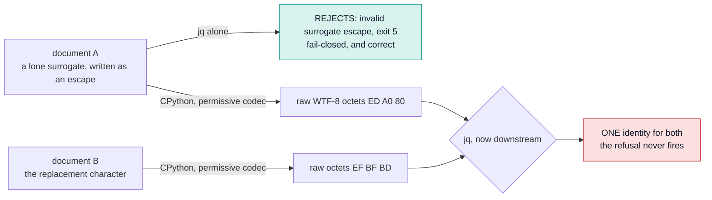
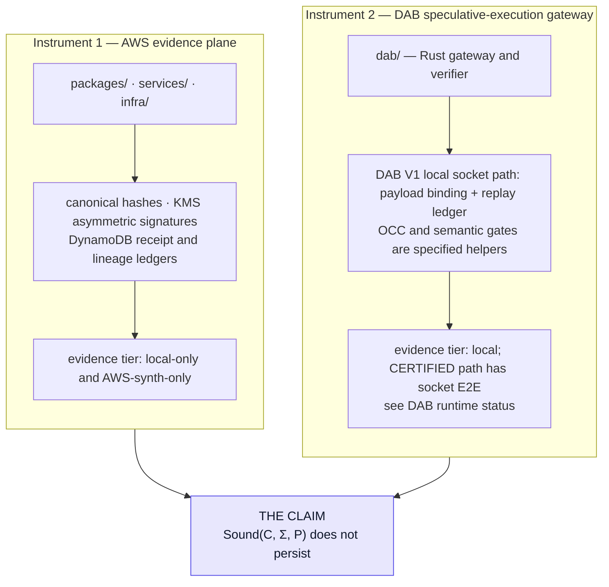
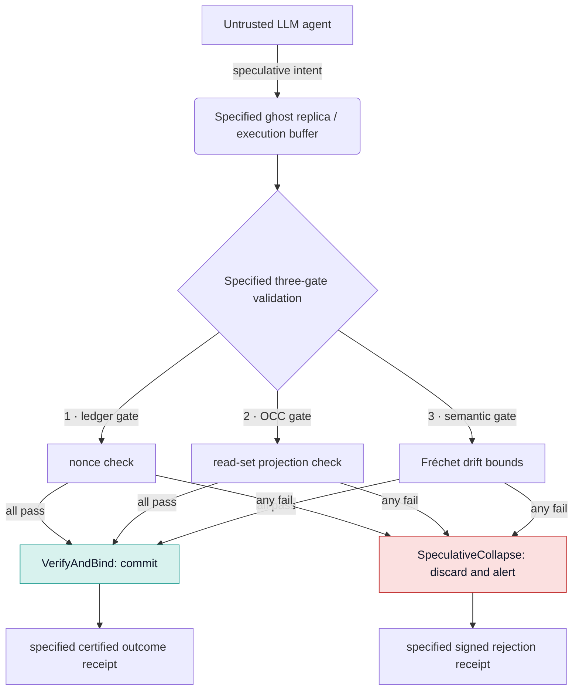
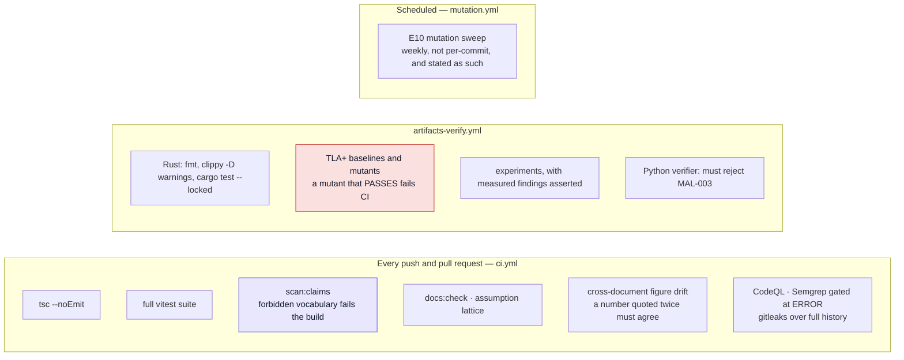

<div align="center">

# Ghost-Ark

**A verifier and measurement harness for the provenance limits of AI-governance receipts.**

*A research artifact of the [S2 Lab](https://s2.ist.psu.edu/), College of Information
Sciences and Technology, The Pennsylvania State University.*

[](https://github.com/PSUCyberSecurityLab/ghost-ark/actions/workflows/ci.yml)
[](https://github.com/PSUCyberSecurityLab/ghost-ark/actions/workflows/artifacts-verify.yml)
[](https://www.npmjs.com/package/@ghost-ark/kernel-probe)
[](./LICENSE)
[](./docs/artifact/CI_COVERAGE.md)
[](./docs/compliance/non-claims.md)

</div>


---

> **The research claim, in one sentence.** A governance receipt identifies an execution only
> up to the *kernel* of its canonicalizer — the set of distinct inputs the canonicalizer maps
> to the same digest — and because that kernel is fixed while the set of downstream consumers
> keeps growing, **receipt soundness does not persist over time even when nothing about the
> receipt system changes.**

Ghost-Ark is the executable demonstration of that claim. It ships the verifier, the
adversarial corpora, the formal models, and the measurement harness needed to check it —
including real unintended kernel members found in Ghost-Ark's *own* canonicalizer.


**What this is not.** Not a proof that any model, output, or deployment is safe, aligned,
compliant, or correct. Not post-quantum secure. Not hardened for deployment. Ghost-Ark
evaluates the *identifiability structure* of evidence, never the meaning of what the evidence
describes. Every non-claim is mechanically enforced — see [Claim discipline](#8-claim-discipline--how-to-read-this-repository-adversarially).

---

## Start here — five doors, one hop each

| | Question | Where it is answered |
|:--|:---|:---|
| 1 | **What is claimed, and what would refute it?** | [00_THESIS.md](./docs/research/00_THESIS.md) — one page, five stated falsifiers, every claim beside its command |
| 2 | **How do I check it?** | [EXPERIMENTS.md](./docs/research/EXPERIMENTS.md) — every number with the command that produced it, and its coverage boundary |
| 3 | **What is *not* claimed?** | [non-claims.md](./docs/compliance/non-claims.md), enforced by `npm run scan:claims` |
| 4 | **What is unverified, and what can rot silently?** | [CI_COVERAGE.md](./docs/artifact/CI_COVERAGE.md) · [STATUS_AND_LIMITATIONS.md](./docs/artifact/STATUS_AND_LIMITATIONS.md) |
| 5 | **What is useful without trusting this project at all?** | [kernel-probe](./tools/kernel-probe/README.md) — one file, no install, nothing from this repository |

Reviewing adversarially? Start instead at the
[Reviewer Attack Sheet](./docs/artifact/REVIEWER_ATTACK_SHEET.md): the ten sharpest questions
against this work, answered with commands, including the unflattering ones.

---

## Table of contents

1. [The claim, precisely](#1-the-claim-precisely)
2. [Run it — 60 seconds, then 5 minutes](#2-run-it--60-seconds-then-5-minutes)
3. [The evidence atlas](#3-the-evidence-atlas)
4. [The figures that carry the argument](#4-the-figures-that-carry-the-argument)
5. [Falsifiers, and where each one now stands](#5-falsifiers-and-where-each-one-now-stands)
6. [What is not established](#6-what-is-not-established)
7. [The two instruments](#7-the-two-instruments)
8. [Claim discipline — how to read this repository adversarially](#8-claim-discipline--how-to-read-this-repository-adversarially)
9. [Inside the repository](#9-inside-the-repository)
10. [Validation lanes](#10-validation-lanes)
11. [Appendix — evidence maturity checklist](#appendix--evidence-maturity-checklist)

---

## 1. The claim, precisely

Write `ker(C)` for the set of input pairs a canonicalizer `C` maps to the same digest. Two
executions inside the same kernel class are, to every receipt consumer, **the same
execution**. So the question a receipt actually answers is not "what happened?" but "what
happened, up to the resolution of the canonicalizer that produced this receipt's identity?"

**Receipt soundness is a ternary relation `Sound(C, Σ, P)`** over a canonicalizer `C`, an
input alphabet `Σ`, and a consumer set `P` — not a property of `C` alone:

- soundness is **monotone in the alphabet** — a larger `Σ` can only add kernel members;
- soundness is **antitone in the consumer set** — a larger `P` can only add distinctions that
  must be preserved.

Therefore **soundness does not persist**. There is no fix internal to the canonicalizer,
because the failure is not in the canonicalizer. Two corollaries this repository demonstrates
rather than asserts:

| | Corollary | Where it is measured |
|:--|:---|:---|
| **C1** | The kernel is a property of the whole `parse → canonicalize → digest` pipeline, not of the canonicalizer. Distinctions are commonly destroyed by the **parser**, before any audited code runs. | E1, E7, E11 |
| **C2** | Real, currently-shipping canonicalizers — including Ghost-Ark's own — contain unintended kernel members that named, deployed consumers distinguish under E16's recorded policy. | E1, E11, E16 |

Formal statement, including why the relation is *ternary* rather than binary:
[PROVENANCE_KERNEL_PROBLEM.md](./docs/research/PROVENANCE_KERNEL_PROBLEM.md).

> **On novelty, stated plainly.** The general phenomenon is not new. W3C XML Signature
> §8.1.1 ("Only What is Signed is Secure") states it normatively, Momot et al. named parser
> differentials as a weakness class at IEEE SecDev 2016, and concurrent work exists
> (arXiv:2608.06508, submitted six days before this program opened). What this repository
> contributes is a **measurement** and a **composition result**, not a new vulnerability
> class. See [PRIOR_ART_AND_NOVELTY.md](./docs/research/PRIOR_ART_AND_NOVELTY.md).

---

## 2. Run it — 60 seconds, then 5 minutes

### The narrowest useful demo: verify a receipt locally

Given a sample receipt, a public key, and an expected tenant, the verifier checks canonical
receipt identity, canonical payload digest, tenant expectation, and RSA-PSS signature
validity — entirely locally, against the supplied public key.

```bash
npm ci
```

```bash
npm run ghost-verify -- --receipt examples/sample-receipts/valid-receipt.json --key examples/sample-receipts/public-key.pem --tenant acme-lab
```

Tampering with the receipt payload, tenant, digest, algorithm, or signature changes the
verdict to **FAIL**.

### The actual research contribution

The demo above shows the machinery works. These experiments are the contribution — each
prints measured results, its own coverage boundary, and its non-claim.

```bash
npm run experiments
```

### The part that is useful without Ghost-Ark

`kernel-probe` takes **your** canonicalizer and reports which real distinctions it destroys.
One file, no install, nothing from this repository, no receipt, no AWS, no account, and no
trust in this project required.

```bash
curl -O https://raw.githubusercontent.com/PSUCyberSecurityLab/ghost-ark/main/tools/kernel-probe/kernel-probe.mjs
```

```bash
node kernel-probe.mjs --command "jq -S -c ."
```

Background and findings: [KERNEL_PROBE.md](./docs/research/KERNEL_PROBE.md). Also published
as [`@ghost-ark/kernel-probe`](https://www.npmjs.com/package/@ghost-ark/kernel-probe) with an
npm provenance attestation binding the tarball to this repository and the CI run that built
it — which is supply-chain custody, and is not evidence about the tool's conclusions.

### Zero-credential hands-on path

```bash
./scripts/bootstrap-local.sh
```

```bash
./scripts/run-local-demo.sh
```

---

## 3. The evidence atlas

Fifteen experiments and one declared frame probe. Every experiment carries a declared **provenance** — `census` (exact counts,
no intervals) or `sampled` (a declared frame, so intervals are legitimate) — because the
single most common inferential error in this literature is quoting a census as if it were a
sample.

| | Experiment | Provenance | Measured result | Command |
|:--|:---|:---|:---|:---|
| **E1** | Provenance kernel census | census | 31 pathology classes × 5 pipelines. **5 unintended kernel members in Ghost-Ark's own canonicalizer**; 0 under strict admission, with zero rejection-asymmetry. The kernel is set by the *parser*, not the canonicalizer. | `npm run experiment:e1` |
| **E1-B** | Randomized kernel probe | **sampled** | The only experiment entitled to intervals: **52.5% [49.0, 56.1]** of semantics-changing mutations collapse unguarded vs **0.0% [0.0, 0.5]** guarded — disjoint 95% Wilson intervals over a shared denominator | `npm run experiment:e1b` |
| **E2** | Verification cost | census | p50 with IQR against a declared parse-only baseline on a recorded host. Asymmetric verification is **65.89×** the baseline; canonicalization is 3.37× | `npm run experiment:e2` |
| **E3** | Adversarial corpus detection | census | A 30-fixture corpus through the real verifier, stratified by who rejects: **26/26 verifier-intrinsic**, 3/3 unmutated controls PASS, 2 documented boundaries excluded from the rate | `npm run experiment:e3` |
| **E4** | Metamorphic guard | census | Forces each verifier check to pass and re-runs the corpus. Detection drops 25 → 1, and the survivor is a parse failure. **Tautology verdict: PASS** | `npm run experiment:e4` |
| **E4-B** | Compromised-signer fixtures | census | Four fixtures modelling an attacker who controls the signing key, which made `receipt_id` load-bearing for the first time | `npm run experiment:e4b` |
| **E5** | Cross-language verifier agreement | census | 28/28 rejects and 2/2 accepts unanimous across Node and Python; 0 peer disagreements, 0 subsumption violations | `npm run experiment:e5` |
| **E6** | Verifier option-confusion matrix | census | Over 540 option cells, adding a correct consumer expectation never turns a rejection into an acceptance. **Antitonicity measured, not assumed**; 8/8 invariants hold | `npm run experiment:e6` |
| **E7** | Cross-language differential fuzz | census | Fuzzing V8 / CPython / jq finds **8 structural divergence classes** over four mechanisms, and every *pair* of arms disagrees somewhere | `npm run experiment:e7` |
| **E10** | Mutation score over the trust kernel | census | Does the suite notice when the kernel is wrong? Ten declared files, scope recomputed from the real import graph every run | `npm run mutation` |
| **E11** | Third-party canonicalizers | census | The same alphabet against Rust `serde_json`, Ruby, CPython, and jq — none written here. All four exhibit unintended kernel members; **none exhibits the 2⁵³ collapse**, which narrows E1 | `npm run experiment:e11` |
| **E12** | Real-traffic kernel incidence | **sampled** | 3,000 uniform random draws from Sigstore Rekor. **0 of 64 eligible payloads carried any pathology class.** This result argues *against* the thesis and is reported as found | `npm run experiment:e12` |
| **E13** | Kernel composition | census | The kernel is **not compositional**, in both directions. An upstream normalization can disable a downstream fail-closed refusal — demonstrated with real `jq` and CPython | `npm run experiment:e13` |
| **E14** | Verifier over third-party primitives | census | Re-runs the verification rules with canonical JSON and base64 by CPython and SHA-256/HMAC/RSASSA-PSS by **OpenSSL** — no Ghost-Ark code in the security path. **31/31 decisions agree; 3/3 committed canonical identities reproduced.** Narrows the shared-misreading gap; does not close it | `npm run experiment:e14` |
| **E15** | npm sampling-frame probe | *probe, not an experiment* | Whether a second real-traffic population is reachable. A defensible frame **is** reachable over 4,283,913 packages; the binding constraint is eligibility — **0 of 40** drawn packages carry a provenance attestation. Specified and costed, not run | `npm run experiment:e15-frame-probe` |
| **E16** | Named consumer distinguishability | census | Four named, version-pinned consumer engines reach different decisions on documents mapping to one receipt identity; the equivalent-pair discriminator holds. **Existence, not prevalence.** | `npm run experiment:e16` |

Measured numbers, findings, coverage boundaries, and a written list of **eleven retracted
prior claims**: [EXPERIMENTS.md](./docs/research/EXPERIMENTS.md). Retractions are listed
rather than deleted, because a quietly removed claim is indistinguishable from a claim that
was never made.

---

## 4. The figures that carry the argument

Every figure below is generated by `npm run figures` from
[`docs/assets/figure-data.json`](./docs/assets/figure-data.json), a committed data file that
records, per block, the command that produced the numbers and the date it was run. A figure
therefore cannot drift from the number it depicts. What the generator does *not* do is check
that the data file is true — that is the harnesses' job.

### 4.1 The census, in full

Not a summary of the census: the census. Read a column downward for one pipeline's
behaviour, a row across for how five pipelines disagree about one input pair.


Three things are worth staring at. The two Ghost-Ark arms and the naive control **disagree**
with the independent-parser arm on `integer-precision-loss` — same canonicalization rules,
different parser, different kernel, which is corollary C1 as a single cell. The mitigation
column reaches zero **without** a single rejection-asymmetry, which is what makes it a fix
rather than a trade. And `unicode-nfc-vs-nfd` is amber everywhere: canonical JSON
over-discriminates on a name every consumer treats as one string, in every arm, so it is not
something this project could simply fix.

### 4.2 Where verification time actually goes


### 4.3 The measurement that argued against us

F2 predicted the pathology alphabet would prove to be an artifact of what the author chose to
look at. It was tested directly, against real supply-chain traffic, and it was **confirmed**.


The honest position is now stronger in one direction and weaker in the other, and both halves
belong in the same sentence:

> These collapses are real, constructible, and exhibited by four independent third-party
> canonicalizers (E11). They did **not** occur in a random sample of real supply-chain
> attestation payloads (E12). **C2 stands as a statement about what is possible and does not
> stand as a statement about what is prevalent.** The pathology alphabet is adversarial
> fiction with respect to this traffic.

Two things E12 does not settle, recorded so the confirmation is not over-read. Its zeros are
not equally informative — `unsafe-magnitude-integer` had **zero opportunities** to fire,
because the entire corpus contains 103 numbers — and at the level of independent producers
the sample has n = 16, below the interval floor, so no rate can be bounded there at all.

### 4.4 Would the tests notice if the kernel were wrong?

Every other gate in this repository answers "does the code still do what the tests say?" E10
answers the question all of them assume.


A surviving mutant is a **demonstrated** gap. A killed mutant is only the absence of that one
gap. Mutation operators are a proxy for defects, not a generator of them: a wrong algorithm
choice, a missing check nobody wrote, or a specification misreading shared by code and tests
alike lies entirely outside them.

### 4.5 The formal models


Two runners, two scopes — both numbers are correct, so read the scope before quoting either.
`tools/proofs/run-tlc.sh` is the **gate**: five baselines must pass and five mutants must
violate. `make proof` additionally checks `DAB_ExecutionBoundary`, which is clean over 51,106
distinct states but ships **no mutant**, so that result is one-sided and is excluded from the
gate rather than counted as a sixth pair.

### 4.6 The evidence ladder

Where every result in this repository actually stands, ordered by how much of the world it
survives contact with.


---

## 5. Falsifiers, and where each one now stands

Stated before the fact so the thesis is refutable rather than merely defended.

| # | Falsifier | Status |
|:--|:---|:---|
| **F1** | **The ternary framing is unnecessary.** Exhibit a canonicalizer sound for every consumer set over a realistic alphabet, with no fail-closed rejections. | Open. E6 measures antitonicity directly over 540 option cells and finds it holds. |
| **F2** | **Unintended kernel members are an artifact of the curated alphabet.** | **CONFIRMED, 2026-08-12.** E12 found 0 of 64 real payloads carrying any class. The claim contracts to "possible, not observed". |
| **F3** | **The consumer set is stable in practice**, so antitonicity never bites. | Open and unmeasured. Honestly the most under-attacked of the five. |
| **F4** | **A parser-independent kernel.** Show the pipeline kernel is fixed by canonicalization alone. | Refuted by E1, E7, and E11: no two independent pipelines induce the same equivalence relation. |
| **F5** | **The corpus results are tautological.** | E4 exists precisely to test this and reports PASS. A failure here would void E3. |

**F2 was the live weakness, and it was attacked directly rather than argued around.** Three
moves narrowed it — independence (E11), breadth (the alphabet grew from 12 to 31 classes and
widening it found *more* defects rather than diluting the finding), and a genuinely sampled
arm (E1-B) — and then a fourth measured it and confirmed it.

**E16 then closed the next, narrower gap: a named consumer had not been shown to distinguish
any pair.** OPA/Rego, CUE, jq, and CPython each reached different decisions under E16's
recorded policy on a pair the receipt canonicalizer maps to one identity. That converts the
result from structural to consequential, but only as an existence result: E12's zero findings
in its real-traffic sample still leave incidence unmeasured.

### The composition result, which is the sharpest thing here

E13 asks whether soundness composes. It does not, in either direction, and one counterexample
is reproducible with software neither written nor configured by this project:



`jq`'s guard is written against the **escape syntax**; the same condition arriving as **raw
bytes** is not observable to it. A normalization step placed in front of a fail-closed
verifier disabled that verifier's refusal.

Stated in the same breath, because it bounds the result: this requires **one permissive codec
configuration, and that configuration was chosen by the harness, not by any default.** No
pair of all-default hops on the recording machine exhibits it. The mechanism is demonstrated;
its incidence in deployed pipelines is **unmeasured**.

The more actionable half is the repairs. Exhaustively over a four-document finite model —
625 hops, 390,625 compositions — there are **1,480 forward counterexamples and zero repairs
by separation**. An upstream collapse cannot be undone downstream, only refused. Every repair
that exists is by rejection, and the largest group is a raw-byte admission gate placed
*before* anything parses, which is the layer the requirement is actually about.

---

## 6. What is not established

Stated here, ahead of the results, rather than left for a reviewer to discover.

- **No incidence estimate for consumer-relevant divergence.** E16 establishes that named,
  version-pinned consumers *can* differ on a collapsed pair; E12 found 0 of 64 eligible
  real-traffic payloads carrying any pathology class. This repository cannot say how often a
  receipt identity produces divergent consumer outcomes in deployed traffic.
- **No live AWS evidence bundle exists in this repository.** Every AWS-path claim is
  local-only or synth-only. CDK synthesis creates no infrastructure and demonstrates no
  runtime behaviour.
- **No third-party reimplementation of the verifier — narrowed, not closed.** E14 removes this
  project's code from every cryptographic and encoding decision, and 31/31 decisions still
  agree. What it cannot reach is the rule sequencing: which checks run, over which fields.
  Both arms implement that from the same reading, so a misreading there would be reproduced
  faithfully by both. Only an implementation written by somebody else fixes it.
- **No second real-traffic population — now costed rather than merely absent.** E15's probe
  establishes that a defensible npm frame *is* reachable (4,283,913 packages, rank-addressable).
  The obstacle is eligibility: 0 of 40 drawn packages carry a provenance attestation, because
  npm provenance postdates most of the registry. Reaching E12's n = 64 would take on the order
  of 10⁴ fetches against a public registry.
- **No cross-machine reproduction of E2.** Single host only.
- **E10 covers the receipt trust kernel only** — ten files. Policy evaluation, runtime, vault,
  retrieval, the gateway, and the CDK stack have no measured test strength at all.
- **CI does not run the Rust or TLA+ artifacts on every commit.** The exact matrix, including
  which artifacts can rot silently, is in [CI_COVERAGE.md](./docs/artifact/CI_COVERAGE.md).

Ghost-Ark is **not certified**, **not hardened for deployment**, and is not an assurance of
AI safety. Passing local tests means local artifacts behave as expected under the implemented
verifier rules. It does not demonstrate live AWS behaviour, deployment security, regulatory
conformance, or AI safety.

---

## 7. The two instruments

Two instruments serve the claim, and **neither is the claim itself**.



Where each instrument is only local, only synthesized, or unbuilt is stated per artifact in
[CI_COVERAGE.md](./docs/artifact/CI_COVERAGE.md).

### The DAB gateway — specified three-gate design

> **Runtime status:** The diagram below is the specified transactional design,
> not a diagram of the complete shipped socket path. The local DAB V1 socket
> prototype wires payload-byte binding and the nonce replay ledger. OCC/read-set
> and semantic evaluators are unit-tested helpers with no live DAB caller. V1
> signs only `CERTIFIED` receipts, does not bind the HTTP target, and does not
> issue signed receipts for every rejection. The TypeScript IPC client is not
> V1-interoperable with the Rust handler. See
> [DAB V1 Runtime Status](./docs/architecture/DAB_RUNTIME_STATUS.md) for the
> component-by-component evidence boundary.



### The AWS evidence plane

| Stage | What it does | Evidence tier |
|:---|:---|:---|
| **Ingest** | S3 drops, SQS fan-in, Lambda handlers, DMS/CDC normalization | synth-only |
| **Transform** | Glue Spark jobs, lightweight Lambda transforms | synth-only |
| **Catalog & govern** | Glue Data Catalog, Athena, Lake Formation grants, LF-Tags, row filters, column controls | synth-only |
| **Attest** | canonical hashes, KMS asymmetric signatures, DynamoDB receipt and lineage ledgers | local + synth |
| **Present** | APIs, OpenSearch evidence search, dashboards, evidence-pack export | synth-only |

**Security defaults** (design stance, not an assurance): tenant slugs are mandatory and must
pass canonical validation; Terraform renders IAM policy variables as
`${aws:PrincipalTag/slug}` with `$${...}` HCL escaping; structured logs redact prompts,
completions, memory, raw bodies, and credential-like fields; the default CDK stack creates an
asymmetric KMS signing key with `SIGN_VERIFY` usage; governed invoke resolves tenant and user
authority from JWT or authorizer context and rejects client-declared fields; governed invoke
fails closed on path/auth tenant mismatch; AWS governed-invoke mode requires a Bedrock model
allowlist and fails closed before Bedrock if unconfigured; plaintext secret values are never
injected into CDK Lambda environment variables.

---

## 8. Claim discipline — how to read this repository adversarially

Every public claim must map to **local evidence**, **live AWS evidence**, or **an explicit
limitation**. Which of the three applies is stated per artifact, never implied.

A reviewer should **accept** narrow evidence claims only where this repository points to a
concrete artifact, command, fixture, test, or preserved evidence bundle. A reviewer should
**reject** any broader reading — that model behaviour has been shown safe, aligned, or
semantically correct; that deployment correctness or conformance has been achieved; that live
AWS validation exists without a preserved live bundle; or that residual risk has been removed.

These rules are enforced by machinery, not by intention:



"Directionally asserted" is the standard this repository holds itself to: CI checks that a
guard can *fail*, not merely that it passes. A green invariant with no failing mutant is not
evidence.

**Unflattering findings stay.** This repository documents CI failing for 40+ consecutive runs
while a document claimed the opposite, a fabricated attestation pass, a pinned hash that
verified nothing for sixteen days, and a shell injection this project introduced into its own
workflow. Removing those would be the opposite of professionalising: a public artifact that
records only its successes is making a claim about itself that its own evidence does not
support.

Further reading: [Threat Model](./docs/security/THREAT_MODEL.md) ·
[Glossary](./docs/GLOSSARY.md) ·
[Claim/Evidence Matrix](./docs/governance/claim-evidence-matrix.md) ·
[Risk Register](./docs/governance/risk-register.md) ·
[Claims Boundary](./docs/release/CLAIMS_BOUNDARY.md) ·
[External Reviewer Guide](./docs/governance/external-reviewer-guide.md) ·
[Public Interface](./docs/artifact/PUBLIC_INTERFACE.md)

---

## 9. Inside the repository


```text
packages/     receipt schemas, canonicalization, policy compilers, lineage models,
              and the deterministic enforcement-runtime primitives.
tools/        experiment harnesses (E1–E13), local verifiers, governance scanners,
              evidence utilities, and the standalone kernel-probe.
tests/        unit, integration, differential, security, AWS-gated, policy-simulation,
              and repo-hygiene lanes.
dab/          the Rust DAB V1 local socket prototype and its independent verifier;
              current wired scope is documented in docs/architecture/DAB_RUNTIME_STATUS.md.
verifiers/    independent Node and Python receipt verifiers, used for E5 agreement.
proofs/       TLA+ specifications, their seeded mutants, and recorded TLC logs.
apps/         user-facing API handlers and console feature surfaces.
services/     ingest, transform, orchestration, governance, signing, search, ledger.
infra/        Terraform account bootstrap plus CDK application stacks.
schemas/      JSON Schema contracts for external validation.
docs/         research, architecture, operations, compliance, and governance.
```

**Which of the 43 research documents matter?**
[RESEARCH_INDEX.json](./docs/research/RESEARCH_INDEX.json) classifies every one as core /
supporting / exploratory / process / non-research, and CI fails if a document is
unclassified. **Eight are core**; 25 supporting, 5 exploratory, 5 process. Start with the
core set.

Test and claim-scan totals are commit-relative rather than a permanent badge.
The paper evidence snapshot records a lower-bound test expectation, a tracked-
source scan, and the commands used to derive them; a current run must be green
and must not fall below that snapshot. See
[`docs/paper/evidence-snapshot.v1.json`](docs/paper/evidence-snapshot.v1.json).

---

## 10. Validation lanes

### Lane 1 — local only, zero AWS credentials

Validates schemas, canonicalization, fixtures, receipt verification, policy logic, scanner
discipline, and unit and integration behaviour.

```bash
npm run validate
```

```bash
npm run test:experiments
```

Rust and TLA+ need non-Node toolchains and are therefore not in `npm run validate`:

```bash
cd dab/gateway && cargo clippy --locked --all-targets -- -D warnings && cargo test --locked
```

```bash
bash tools/proofs/run-tlc.sh
```

v1.7.4 is the pinned toolchain — see `scripts/run-proofs.sh` for why the pin moved off the
rolling v1.8.0 prerelease tag, and [retraction R11](./docs/research/EXPERIMENTS.md) for what
the earlier pin did and did not verify.

Every locally implementable checklist gate, including CDK synthesis but excluding deployment:

```bash
npm run checklist:local
```

The manuscript evidence replay (E2/E3/E4, TLC, tests, and a tracked-source
claim scan):

```bash
make paper-evidence
```

The broader legacy artifact report, which does **not** rerun E2/E3/E4 and may
record quarantined DAB benchmark material, is separate and is not a manuscript
reproduction command:

```bash
make reproduce
```

### Lane 2 — AWS synth validation

```bash
npx cdk synth
```

> CDK synthesis does not create live infrastructure and does not demonstrate runtime
> behaviour.

### Lane 3 — bounded live AWS evidence window

Use only when intentionally collecting live AWS evidence. Local preparation:

```bash
npm run spine:c:local
```

Validate an already-sanitized bundle locally:

```bash
npm run validate:evidence-bundle -- path/to/bundle.json
```

For live capture, see the preflight, evidence-window, and cleanup runbooks under
`docs/operations/runbooks/`.

### Lane 4 — governed invoke

Deterministic pre/post-model policy decisions, locally:

```bash
npm test -- tests/unit/enforcement-runtime/runtime tests/unit/enforcement-runtime/retrieval tests/unit/enforcement-runtime/receipts tests/integration/test_governedInvokeLifecycle.test.ts
```

### Regenerating the figures in this README

```bash
npm run figures
```

---

## Appendix — evidence maturity checklist

This tracks **evidence maturity, not certification status**. A completed item means the
repository contains evidence for that narrow claim. *"Complete locally"* means schemas,
deterministic primitives, examples, and focused tests exist inside this repository; it does
not imply deployed-environment operation.

| Item | Status | Spine | Evidence status |
|:---|:---|:---|:---|
| Thesis, evidence map, falsification conditions | Complete | Research | One page, five stated falsifiers, every claim mapped to a command |
| E1 provenance kernel census | Complete locally | Research | 31 classes × 5 arms; 5 unintended kernel members in Ghost-Ark's own pipeline, 0 under strict admission; curated alphabet, not real traffic |
| E1-B randomized kernel probe | Complete locally | Research | Declared seeded generator; disjoint 95% Wilson intervals; seed-reproducibility asserted in both directions |
| E2 verification cost | Complete locally | Research | p50 + IQR vs declared baseline, host recorded; single machine only |
| E3 adversarial corpus detection | Complete locally | Research | 26/26 verifier-intrinsic, 3/3 controls; no RSA/KMS compromised-signer coverage |
| E4 metamorphic guard | Complete locally | Research | Tautology verdict PASS; self-tested with a known-tautological and a known-genuine detector |
| E5 cross-language verifier agreement | Complete locally | Research | Unanimous across Node and Python; independence is **authorial, not third-party** — partially narrowed by E14 |
| E7 differential fuzz | Complete locally | Research | Cross-runtime portability is a measured **negative** result |
| E10 mutation score | Complete locally | Research | Ten declared kernel files; scope recomputed from the import graph; weekly, not per-commit |
| E11 third-party canonicalizers | Complete locally | Research | Four external ecosystems; also **narrows** E1 by excluding the 2⁵³ class from JSON generally |
| E12 real-traffic incidence | Complete | Research | Falsifier F2 attacked directly and **confirmed**; producer-clustered n = 16 bounds no rate |
| E13 kernel composition | Complete locally | Research | Exhaustive over a four-document model plus nine real hops; repair-impossibility argued and measured |
| Rust gateway and verifier in CI | Complete | Research | clippy `-D warnings`, `--locked`; previously unguarded entirely |
| TLA+ specs + mutants in CI | Complete | Research | 6 clean baselines and 5 violating mutants recorded; 5 paired baseline/mutant checks gate two-sided invariants, while `DAB_ExecutionBoundary` is one-sided; `proofs/cloud/*` remain unchecked stubs |
| Real-traffic kernel frequency | Measured, not narrowed | Research | E12 confirmed F2. The claim contracted rather than the evidence growing |
| Named consumer that distinguishes a pair | Measured locally | Research | E16 observes different decisions under its recorded, version-pinned policies; existence, not prevalence |
| E14 verifier over third-party primitives | Complete locally | Research | 31/31 agreement with an arm whose cryptography is OpenSSL's and whose canonicalizer is CPython's; rule sequencing still authored here |
| E15 npm frame probe | Probe complete | Research | Frame reachable, eligibility 0/40, run specified and costed rather than executed |
| Claim/evidence matrix | Complete | Spine A | Versioned local documentation and claim boundaries |
| Non-claim scanner | Complete | Spine A | Local enforcement with exact-path quarantine |
| Receipt reproducibility harness | Complete | Spine B | Local tests and fixtures |
| Malicious receipt corpus | Complete | Spine B | Local negative tests, numbered contiguously so a deleted fixture leaves a gap |
| Standalone verifier and replay | Complete locally | Spine B | Built-ins-only verifier, differential agreement, manifest replay; no external audit |
| Evidence bundle schema and sanitizer | Complete (Spine C local) | Spine C | L2 schema plus L3 local validator tests; synthetic fixture only |
| Live AWS evidence bundles | **Not complete** | Spine C | Requires a bounded live AWS window |
| Key lifecycle and rotation protocol | Complete locally | Spine D | Epoch/signing policy and runbook tested; live KMS rotation remains AWS-required |
| Guardrail observation schema | Complete locally | Spine E | Closed schema, examples, privacy rules; no runtime capture |
| CC-Framework correlation analysis | Complete locally | Spine F | Adapter, co-failure report, Fréchet bounds; no live or external integration |
| Checkpoint / inclusion / witness model | Partial | Spine G | Local schemas and verifier mechanics; no independent witness |
| Object Lock retention / denial evidence | **Not complete** | Spine G / C | Requires an approved live AWS evidence window |
| Human review workflow | Complete locally | Spine H | Schema, false-positive and escalation examples; no operating queue |
| Incident / failure reporting workflow | Complete locally | Spine H | Schema, synthetic incident; no operational response evidence |
| Risk register | Complete | Spine A | Local risk inventory with residual evidence gaps |
| Control mapping to NIST AI RMF / ISO 42001 | Complete locally | Compliance | Candidate evidence crosswalk; not a conformity assessment |
| External reviewer instructions | Complete | Spine A | Local commands, rejection rules, and AWS boundaries |
| Repeatable deployment evidence | Local prep complete | Spine C | Schema, sanitizer, synth gate, runbooks; live bundle absent |

---

## Contributing, citing, reviewing

- **About to contribute?** [CONTRIBUTING.md](./CONTRIBUTING.md) — the invariants that must not
  be weakened, the empirical reporting rules, and the maturity tier every claim must carry.
  Read it before your first pull request.
- **Reviewing this as an artifact?** [README-AE.md](./README-AE.md) and
  [ARTIFACT_EVALUATION.md](./ARTIFACT_EVALUATION.md) — claim-to-command map and stage report.
- **Reporting a vulnerability?** [SECURITY.md](./SECURITY.md).
- **Citing this?** [CITATION.cff](./CITATION.cff). Please cite the software, and read the
  abstract's scope paragraph before citing it as evidence for a security property.

Licensed under the [MIT License](./LICENSE).
