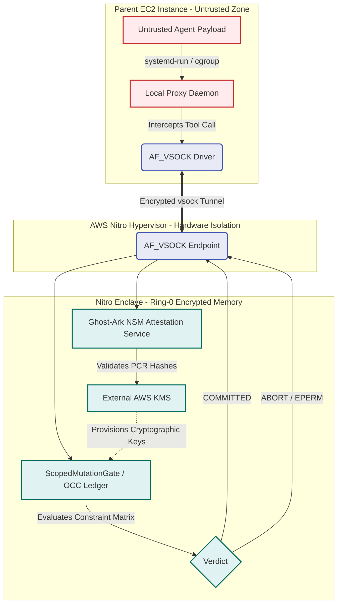

# Nitro Enclave Isolation Architecture

> **Epistemic Status Block:**
> - Memory Encryption: `[DOCUMENTED_DESIGN]` only
> - NSM Attestation: `[NOT_IMPLEMENTED]` — no live AWS validation or CI
>   attestation verification exists
> - Ring 0 eBPF Filtering: `[UNBUILT_PROTOTYPE]` — it is not a runtime control
>
> This is research-only architecture. A prior purported Nitro path was
> retracted as R8 because it was not a working Linux implementation; see
> `docs/research/EXPERIMENTS.md`. No DAB V1 socket execution is enclaved,
> attested, or protected by an OCC ledger in this document's sense. The current
> local runtime boundary is
> [`DAB_RUNTIME_STATUS.md`](../architecture/DAB_RUNTIME_STATUS.md).

This document records a proposed transition blueprint for a future runtime
isolation design. It does not describe a deployed or locally runnable
architecture. If implemented and independently validated, an enclave boundary
could bind selected execution measurements to an attestation model; it would
not by itself prove host-compromise immunity, semantic correctness, or runtime
enforcement of the unimplemented OCC design.

## 1. The Architectural Boundary Shift

Historical sketches referred to `cgroup v2`, POSIX permissions, and a local
socket as if they were an isolation boundary. They are not a deployed
Ghost-Ark DAB V1 control, and this repository makes no current agent-identity
or IPC-isolation claim from them.

Under a future AWS Nitro architecture, the primary EC2 instance could act as
an untrusted forwarder and a specified `ScopedMutationGate` plus ledger could
reside in an isolated enclave virtual machine. No such migration exists here.

### The AF_VSOCK Bridge
Nitro Enclaves have **no persistent storage, no interactive access, and no external networking**. In a future design, the communication vector between the parent EC2 instance and an isolated enclave would be a virtual socket (`AF_VSOCK`).

The proposal would multiplex `AgentExecRequest` payloads over an `AF_VSOCK`
connection. It does not ship a proxy daemon, vsock transport, or attestation
verifier.

## 2. Cryptographic Attestation via NSM

To enforce an enclave boundary subject to the NSM (Nitro Security Module)
attestation signature scheme, a future implementation would need to use the
Nitro Security Module (NSM) and an independently tested verifier. Ghost-Ark
does not currently implement that flow.

1. Upon boot, the Enclave generates an RSA/ECC keypair inside its encrypted memory.
2. The Enclave requests an **Attestation Document** from the underlying Nitro Hypervisor.
3. The Hypervisor physically signs the document, which includes the cryptographic hashes (Platform Configuration Registers - PCRs) of the Enclave's exact boot image (the compiled Rust/C++ Ghost-Ark Daemon), along with the Enclave's public key.
4. The parent EC2 instance routes this Attestation Document to **AWS KMS**.
5. AWS KMS cryptographically verifies the hypervisor signature and the PCR measurements. If the Ghost-Ark daemon is un-tampered, KMS provisions the decryption keys required to manage the OCC ledger back over the `AF_VSOCK` encrypted tunnel.

In a correctly implemented and policy-pinned flow, a measurement mismatch
should prevent key release. This document records that requirement; it is not
evidence that Ghost-Ark or AWS KMS has enforced it.

## 3. Hardware-Blinded Agent Isolation (Mermaid Schematic)

The following schematic is the specified physical isolation boundary. It does
not demonstrate a deployed boundary or establish that a hijacked agent is
blinded from any current Ghost-Ark ledger.

